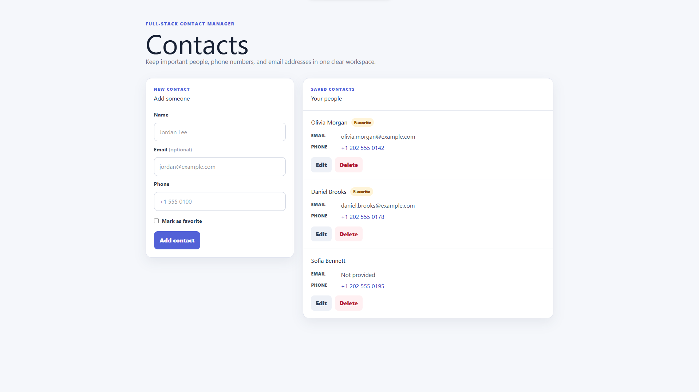
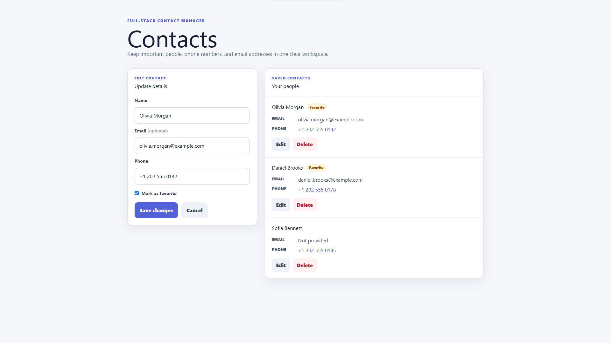

# Contact Management System

A compact CRUD application for storing contacts, editing their details, marking favorites, and deleting entries.

## Highlights

- Create, list, update, and delete contacts
- Typed reactive form with required, length, and email validation
- Responsive, accessible Angular interface
- Clear success and error feedback
- SQL Server persistence through Entity Framework Core
- Environment-specific API URLs and a restricted CORS policy

## Screenshots

### Contact directory



### Edit contact



## Technology

- ASP.NET Core 10 Web API
- Entity Framework Core 10 and SQL Server
- Angular 22, TypeScript, RxJS, Tailwind CSS, and Vitest

## Project structure

- `Api/Contactly` — API, domain model, DTOs, and migrations
- `UI/Contactly.Web` — Angular client

## Local setup

Prerequisites: .NET 10 SDK, SQL Server, Node.js, and npm.

1. Prepare and run the API:

   ```powershell
   cd Api\Contactly
   dotnet restore
   dotnet tool restore
   dotnet ef database update
   dotnet run --launch-profile https
   ```

   The sample connection string creates `ContactsDb` on a local SQL Server. Override `ConnectionStrings:ConnString` through environment variables or local configuration when required.

2. Run the client in another terminal:

   ```powershell
   cd UI\Contactly.Web
   npm ci
   npm start
   ```

3. Open `http://localhost:4200`. The development client calls `https://localhost:7178/api`.

## Security scope

This repository is intentionally scoped as a local, single-user CRUD demo. It does not implement authentication or user isolation, so the API should not be exposed directly to the public internet.

A production deployment must add authentication and authorization, keep HTTPS enabled, restrict CORS origins, and store environment-specific database configuration outside source control.

## API endpoints

| Method | Endpoint | Purpose |
|---|---|---|
| GET | `/api/contacts` | List contacts |
| GET | `/api/contacts/{id}` | Get one contact |
| POST | `/api/contacts` | Create a contact |
| PUT | `/api/contacts/{id}` | Update a contact |
| DELETE | `/api/contacts/{id}` | Delete a contact |

## Validation commands

```powershell
cd Api\Contactly
dotnet build

cd ..\..\UI\Contactly.Web
npm ci
npm test -- --watch=false
npm run build
```

Swagger is available at `https://localhost:7178/swagger` in Development. Example requests are in `Contactly.http`.

